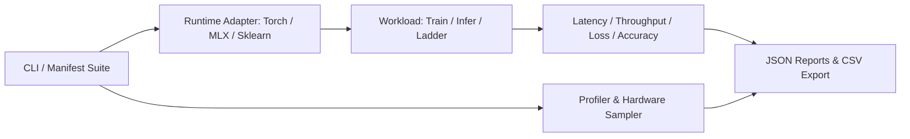

Configured authentication: Managed by agent

Now I'm searching the code to identify key components or functions relevant to the task, aiming to understand the structure and locate where to focus my work.

Load skill: code-search

I have mapped out the full matrix of workloads, hardware execution adapters, and parameter permutations supported by the runtime benchmark utility. Now I will submit a comprehensive execution plan detailing the exact command sequences and workflows needed to evaluate all baseline configurations systematically.

**Requirements**

**Overview & Goals**

The objective is to maximize the utility and reproducibility of hardware benchmarking by establishing a clear, systematic execution matrix for `runtime-bench`. By testing all valid workload, runtime, device, and precision permutations, practitioners can accurately assess execution time, batch throughput, memory footprints, and model quality across CPU (Intel/AMD), Apple Silicon (MPS & MLX), and NVIDIA CUDA hardware without wasted effort or corrupted measurements.

**Scope**

- **In Scope:**
  - Complete command reference for all 5 workload families (`classification`, `transformer`, `embedding`, `operational ladder`, and `micro`).
  - Permutations across execution runtimes (`torch`, `mlx`, `sklearn`) and device backends (`cpu`, `cuda`, `mps`, `gpu`).
  - Pretrained model asset acquisition (`minilm`, `distilbert`, `bert`) and dataset preparation (`ag-news`, `news-pairs`, synthetic tabular, and coffee).
  - TOML experiment suite execution (`experiments/*.toml`).
  - Result comparison, capacity evaluation, and CSV export.
- **Out of Scope:**
  - Modifying internal harness or runtime adapter source code.
  - Fabricating synthetic hardware metrics or allowing silent GPU-to-CPU fallbacks.
  - Unpinned package installations or unmanaged external drivers.

**Workload & Hardware Permutation Matrix**

| Workload Family | Task / Subcommand | Execution Runtime | Supported Devices | Precision Modes | Data / Model Assets Required |
| --- | --- | --- | --- | --- | --- |
| **Classification Lifecycle** | `classification train/infer` | PyTorch (`torch`) | `cpu`, `cuda`, `mps` | FP32 (all), FP16/BF16 (CUDA) | Synthetic (default) or Tabular CSV |
| **Classification Lifecycle** | `classification train/infer` | Apple MLX (`mlx`) | `cpu`, `gpu` | FP32 | Synthetic (default) or Tabular CSV |
| **Sequence Transformer** | `transformer train/infer` | PyTorch (`torch`) | `cpu`, `cuda`, `mps` | FP32 (all), FP16/BF16 (CUDA) | Synthetic sequences or AG News CSV |
| **Contrastive Embedding** | `embedding train/infer` | PyTorch (`torch`) | `cpu`, `cuda`, `mps` | FP32 (all), FP16/BF16 (CUDA) | Paired CSV (`news-pairs.csv`) + `minilm` |
| **Operational Ladder** | `classify` | Scikit-Learn (`sklearn`) | `cpu` | FP32 | Synthetic (default) or `coffee.csv` |
| **Operational Ladder** | `embeddings` | PyTorch (`torch`) | `cpu`, `cuda`, `mps` | FP32 (all), FP16/BF16 (CUDA) | AG News CSV + `minilm`/`distilbert`/`bert` |
| **Operational Ladder** | `infer` (fill-mask) | PyTorch (`torch`) | `cpu`, `cuda`, `mps` | FP32 (all), FP16/BF16 (CUDA) | AG News CSV + `distilbert`/`bert` |
| **Operational Ladder** | `finetune` (4-class) | PyTorch (`torch`) | `cpu`, `cuda`, `mps` | FP32 (all), FP16/BF16 (CUDA) | AG News CSV + `distilbert`/`bert` |
| **Micro Workloads** | `smoke`, `coffee`, `news`, `stateful` | PyTorch (`torch`) | `cpu`, `cuda`, `mps` | FP32 (all), FP16/BF16 (CUDA) | Synthetic or local CSV |
| **Micro Workloads** | `smoke`, `coffee` | Apple MLX (`mlx`) | `cpu`, `gpu` | FP32 | Synthetic or `coffee.csv` |

**Command Reference & Permutations**

**1. Environment Synchronization & Package Extras**

Select the appropriate `uv` synchronization command matching your target machine architecture:

```sh

# CPU / General baseline (Linux, macOS, Windows)

uv sync --locked --extra cpu --extra pipeline

# NVIDIA GPU (Linux, Windows / WSL2 with CUDA drivers)

uv sync --locked --extra cuda --extra pipeline

# Apple Silicon with native MLX support (macOS ARM64)

uv sync --locked --extra cpu --extra pipeline --extra mlx
```

---

**2. Asset Acquisition & Pre-Benchmarking Downloads**

All downloads must occur before benchmark measurement to prevent network I/O from contaminating execution timing:

```sh

# Fetch AG News dataset

uv run --locked --extra cpu --extra pipeline runtime-bench-fetch news

# Fetch pinned pretrained model weights

uv run --locked --extra cpu --extra pipeline runtime-bench-fetch minilm
uv run --locked --extra cpu --extra pipeline runtime-bench-fetch distilbert
uv run --locked --extra cpu --extra pipeline runtime-bench-fetch bert

# Generate paired dataset for contrastive embedding lifecycle

uv run --locked --extra cpu --extra pipeline runtime-bench embedding pairs \
  --data data/ag-news.csv --output data/news-pairs.csv --limit 2000
```

*(Note: On NVIDIA CUDA machines, replace `--extra cpu` with `--extra cuda` across all commands).*

---

**3. Tabular Classification Permutations (`classification`)**

**PyTorch Runtime (`--runtime torch`)**

```sh

# CPU Baseline

uv run --locked --extra cpu runtime-bench classification train --device cpu --checkpoint results/classifier-cpu.pt
uv run --locked --extra cpu runtime-bench classification infer --device cpu --checkpoint results/classifier-cpu.pt

# Apple Silicon MPS

uv run --locked --extra cpu runtime-bench classification train --device mps --checkpoint results/classifier-mps.pt
uv run --locked --extra cpu runtime-bench classification infer --device mps --checkpoint results/classifier-mps.pt

# NVIDIA CUDA FP32

uv run --locked --extra cuda runtime-bench classification train --device cuda --checkpoint results/classifier-cuda-fp32.pt --precision fp32
uv run --locked --extra cuda runtime-bench classification infer --device cuda --checkpoint results/classifier-cuda-fp32.pt

# NVIDIA CUDA FP16 & BF16 Mixed Precision

uv run --locked --extra cuda runtime-bench classification train --device cuda --checkpoint results/classifier-cuda-fp16.pt --precision fp16
uv run --locked --extra cuda runtime-bench classification train --device cuda --checkpoint results/classifier-cuda-bf16.pt --precision bf16
```

**Native Apple MLX Runtime (`--runtime mlx`)**

```sh

# Apple MLX GPU

uv run --locked --extra cpu --extra mlx runtime-bench classification train --runtime mlx --device gpu --checkpoint results/classifier-mlx-gpu.pt
uv run --locked --extra cpu --extra mlx runtime-bench classification infer --runtime mlx --device gpu --checkpoint results/classifier-mlx-gpu.pt

# Apple MLX CPU

uv run --locked --extra cpu --extra mlx runtime-bench classification train --runtime mlx --device cpu --checkpoint results/classifier-mlx-cpu.pt
uv run --locked --extra cpu --extra mlx runtime-bench classification infer --runtime mlx --device cpu --checkpoint results/classifier-mlx-cpu.pt
```

---

**4. Sequence Transformer Permutations (`transformer`)**

```sh

# CPU Baseline (Synthetic sequence training & restored inference)

uv run --locked --extra cpu runtime-bench transformer train --device cpu --checkpoint results/transformer-cpu.pt --width 64 --length 32 --batch 32
uv run --locked --extra cpu runtime-bench transformer infer --device cpu --checkpoint results/transformer-cpu.pt --batch 32

# Apple Silicon MPS

uv run --locked --extra cpu runtime-bench transformer train --device mps --checkpoint results/transformer-mps.pt --width 64 --length 32 --batch 32
uv run --locked --extra cpu runtime-bench transformer infer --device mps --checkpoint results/transformer-mps.pt --batch 32

# NVIDIA CUDA FP32 / FP16

uv run --locked --extra cuda runtime-bench transformer train --device cuda --checkpoint results/transformer-cuda.pt --width 64 --length 32 --batch 32 --precision fp32
uv run --locked --extra cuda runtime-bench transformer infer --device cuda --checkpoint results/transformer-cuda.pt --batch 32
uv run --locked --extra cuda runtime-bench transformer train --device cuda --checkpoint results/transformer-cuda-fp16.pt --width 64 --length 32 --batch 32 --precision fp16
```

---

**5. Contrastive Text Embedding Permutations (`embedding`)**

```sh

# CPU Baseline

uv run --locked --extra cpu --extra pipeline runtime-bench embedding train --device cpu --data data/news-pairs.csv --checkpoint results/embed-cpu --batch 8 --length 64
uv run --locked --extra cpu --extra pipeline runtime-bench embedding infer --device cpu --data data/news-pairs.csv --checkpoint results/embed-cpu --batch 8 --length 64

# Apple Silicon MPS

uv run --locked --extra cpu --extra pipeline runtime-bench embedding train --device mps --data data/news-pairs.csv --checkpoint results/embed-mps --batch 8 --length 64
uv run --locked --extra cpu --extra pipeline runtime-bench embedding infer --device mps --data data/news-pairs.csv --checkpoint results/embed-mps --batch 8 --length 64

# NVIDIA CUDA

uv run --locked --extra cuda --extra pipeline runtime-bench embedding train --device cuda --data data/news-pairs.csv --checkpoint results/embed-cuda --batch 8 --length 64 --precision fp32
uv run --locked --extra cuda --extra pipeline runtime-bench embedding infer --device cuda --data data/news-pairs.csv --checkpoint results/embed-cuda --batch 8 --length 64
```

---

**6. Operational Workload Ladder Permutations**

**Step 1: Scikit-Learn Tabular Baseline (`classify`)**

```sh
uv run --locked --extra cpu --extra pipeline runtime-bench classify --device cpu --limit 2000 --steps 50
```

**Step 2: NLP Tokenization & Embedding Pipeline (`embeddings`)**

```sh

# CPU (MiniLM / BERT)

uv run --locked --extra cpu --extra pipeline runtime-bench embeddings --device cpu --model minilm --data data/ag-news.csv --batch 32 --length 128
uv run --locked --extra cpu --extra pipeline runtime-bench embeddings --device cpu --model bert --data data/ag-news.csv --batch 32 --length 128

# Apple MPS

uv run --locked --extra cpu --extra pipeline runtime-bench embeddings --device mps --model minilm --data data/ag-news.csv --batch 32 --length 128

# NVIDIA CUDA

uv run --locked --extra cuda --extra pipeline runtime-bench embeddings --device cuda --model minilm --data data/ag-news.csv --batch 32 --length 128
```

**Step 3: Pretrained Fill-Mask Inference (`infer`)**

```sh

# CPU (DistilBERT / BERT)

uv run --locked --extra cpu --extra pipeline runtime-bench infer --device cpu --model distilbert --data data/ag-news.csv --batch 32 --length 128
uv run --locked --extra cpu --extra pipeline runtime-bench infer --device cpu --model bert --data data/ag-news.csv --batch 32 --length 128

# Apple MPS

uv run --locked --extra cpu --extra pipeline runtime-bench infer --device mps --model distilbert --data data/ag-news.csv --batch 32 --length 128

# NVIDIA CUDA

uv run --locked --extra cuda --extra pipeline runtime-bench infer --device cuda --model distilbert --data data/ag-news.csv --batch 32 --length 128
```

**Step 4: Full-Model Fine-Tuning (`finetune`)**

```sh

# CPU

uv run --locked --extra cpu --extra pipeline runtime-bench finetune --device cpu --model distilbert --data data/ag-news.csv --batch 16 --steps 50

# Apple MPS

uv run --locked --extra cpu --extra pipeline runtime-bench finetune --device mps --model distilbert --data data/ag-news.csv --batch 16 --steps 50

# NVIDIA CUDA

uv run --locked --extra cuda --extra pipeline runtime-bench finetune --device cuda --model distilbert --data data/ag-news.csv --batch 16 --steps 50
```

---

**7. Standalone Micro-Workloads (`run <task>`)**

```sh

# Smoke MLP (PyTorch CPU / MPS / CUDA & MLX GPU)

uv run --locked --extra cpu runtime-bench run smoke --runtime torch --device cpu
uv run --locked --extra cpu runtime-bench run smoke --runtime torch --device mps
uv run --locked --extra cuda runtime-bench run smoke --runtime torch --device cuda
uv run --locked --extra cpu --extra mlx runtime-bench run smoke --runtime mlx --device gpu

# Coffee Tabular MLP (PyTorch & MLX)

uv run --locked --extra cpu runtime-bench run coffee --runtime torch --device cpu
uv run --locked --extra cpu --extra mlx runtime-bench run coffee --runtime mlx --device gpu

# News & Stateful Text Models (PyTorch)

uv run --locked --extra cpu runtime-bench run news --runtime torch --device cpu
uv run --locked --extra cpu runtime-bench run stateful --runtime torch --device cpu
```

---

**8. TOML Experiment Suite Execution (`suite`)**

Execute automated parameter sweeps with dedicated trial resets and consolidated reporting:

```sh

# Smoke suite (Batch sizes 8, 32)

uv run --locked --extra cpu runtime-bench suite experiments/smoke.toml --node node-a --condition idle

# Tabular classification training & inference sweeps

uv run --locked --extra cpu runtime-bench suite experiments/classification-train.toml --node node-a --condition idle
uv run --locked --extra cpu runtime-bench suite experiments/classification-infer.toml --node node-a --condition idle

# Sequence Transformer training & inference sweeps

uv run --locked --extra cpu runtime-bench suite experiments/transformer-train.toml --node node-a --condition idle
uv run --locked --extra cpu runtime-bench suite experiments/transformer-infer.toml --node node-a --condition idle

# Contrastive embedding training & inference sweeps

uv run --locked --extra cpu --extra pipeline runtime-bench suite experiments/embedding-train.toml --node node-a --condition idle
uv run --locked --extra cpu --extra pipeline runtime-bench suite experiments/embedding-infer.toml --node node-a --condition idle

# Pretrained NLP operational suite

uv run --locked --extra cpu --extra pipeline runtime-bench suite experiments/nlp.toml --node node-a --condition idle
```

---

**9. Comparison, Capacity & Export Commands**

```sh

# Direct baseline vs candidate comparison (Equal work budget verification)

uv run --locked --extra cpu runtime-bench compare results/report-baseline.json results/report-candidate.json

# Capacity comparison (Includes failed runs or differing work bounds without false speedup claims)

uv run --locked --extra cpu runtime-bench compare --capacity results/report-baseline.json results/report-candidate.json

# Flatten all suite trial results into a CSV matrix for analysis

uv run --locked --extra cpu runtime-bench export results/suite-*/*/*.json --output results/trials.csv
```

**Technical Architecture & Execution Guidelines**

**Architecture Boundaries**

The runtime benchmarking pipeline maintains strict separation across four distinct boundaries:
1. **Harness / CLI (`src/runtime_bench/cli.py` & `experiments.py`):** Parses arguments, manages environment isolation, sets up hardware profilers, coordinates trial repetitions, and structures report outputs.
2. **Runtime Adapter (`torch_runtime.py`, `mlx_runtime.py`, `hf_runtime.py`):** Handles explicit device transfers, tensor allocations, synchronizations, and backend thread budgets.
3. **Workload Definition (`classification.py`, `transformer.py`, `embedding.py`, `operational.py`, `micro.py`):** Defines architectures, data iterators, training steps, evaluation splits, and fingerprint verification.
4. **Profiler & Reporting (`profiling/`, `reporting.py`, `compare.py`):** Samples background hardware counters at 250ms intervals, records RSS/VRAM peaks, tracks batch latency percentiles, and emits JSON/CSV reports.



**Telemetry, Memory & Verification Rules**

- **Explicit Device Binding:** Explicitly requested unavailable accelerators fail immediately rather than silently falling back to CPU (e.g., MPS fallback is strictly disallowed via `PYTORCH_ENABLE_MPS_FALLBACK=0`).
- **Accelerator Synchronization:** CUDA and MPS devices enforce explicit synchronization before and after timed batch loops to ensure true hardware execution timing.
- **Distinct Memory Metrics:** Process RSS, host available memory, NVIDIA NVML device memory, CUDA allocator peaks, and Apple runtime allocation bytes are reported as separate independent metrics rather than unified VRAM.
- **Data Fingerprints & Trial Resets:** Models and datasets are cryptographic SHA-256 fingerprinted; each repeat trial performs clean state resets to guarantee unpolluted measurements.

**Delivery Steps**

**Step 1: Setup Environment and Fetch Model Assets**

All necessary environment dependencies and offline model/dataset artifacts are installed and validated locally.

- Synchronize required `uv` dependency extras based on target hardware (`cpu`, `cuda`, `mlx`, `pipeline`).
- Fetch required NLP dataset assets (`ag-news.csv`) using `runtime-bench-fetch news`.
- Fetch immutable pretrained Hugging Face model checkpoints (`minilm`, `distilbert`, `bert`) using `runtime-bench-fetch`.
- Generate contrastive paired dataset (`data/news-pairs.csv`) from source AG News using `runtime-bench embedding pairs`.

**Step 2: Execute Core Lifecycle and Operational Workload Permutations**

Every workload lifecycle and operational ladder task is executed across its supported runtime and device targets with explicit configurations.

- Execute tabular classification training and checkpoint inference across PyTorch (`cpu`, `cuda`, `mps`) and MLX (`cpu`, `gpu`).
- Execute from-scratch sequence Transformer training and checkpoint inference across PyTorch devices (`cpu`, `cuda`, `mps`).
- Execute contrastive text embedding training and saved encoder inference across PyTorch devices (`cpu`, `cuda`, `mps`).
- Execute operational ladder benchmarks (`classify`, `embeddings`, `infer`, `finetune`) across CPU, NVIDIA CUDA, and Apple MPS.
- Run micro benchmarks (`smoke`, `coffee`, `news`, `stateful`) to evaluate raw compute throughput and kernel resets.

**Step 3: Run Automated TOML Experiment Suites and Export Benchmark Results**

Standardized batch/length sweeps are executed via TOML manifests and aggregated into unified comparison reports and trial CSVs.

- Execute offline TOML experiment manifests (`smoke.toml`, `classification-train.toml`, `classification-infer.toml`, `transformer-train.toml`, `transformer-infer.toml`, `embedding-train.toml`, `embedding-infer.toml`, `nlp.toml`).
- Compare baseline and candidate JSON execution reports with `runtime-bench compare` and `--capacity` flags.
- Flatten all generated suite trial telemetry across nodes and conditions into `results/trials.csv` using `runtime-bench export`.


**Requirements**

**Overview & Goals**

The objective is to maximize the utility and reproducibility of hardware benchmarking by establishing a clear, systematic execution matrix for `runtime-bench`. By testing all valid workload, runtime, device, and precision permutations, practitioners can accurately assess execution time, batch throughput, memory footprints, and model quality across CPU (Intel/AMD), Apple Silicon (MPS & MLX), and NVIDIA CUDA hardware without wasted effort or corrupted measurements.

**Scope**

- **In Scope:**
  - Complete command reference for all 5 workload families (`classification`, `transformer`, `embedding`, `operational ladder`, and `micro`).
  - Permutations across execution runtimes (`torch`, `mlx`, `sklearn`) and device backends (`cpu`, `cuda`, `mps`, `gpu`).
  - Pretrained model asset acquisition (`minilm`, `distilbert`, `bert`) and dataset preparation (`ag-news`, `news-pairs`, synthetic tabular, and coffee).
  - TOML experiment suite execution (`experiments/*.toml`).
  - Result comparison, capacity evaluation, and CSV export.
- **Out of Scope:**
  - Modifying internal harness or runtime adapter source code.
  - Fabricating synthetic hardware metrics or allowing silent GPU-to-CPU fallbacks.
  - Unpinned package installations or unmanaged external drivers.

**Workload & Hardware Permutation Matrix**

| Workload Family | Task / Subcommand | Execution Runtime | Supported Devices | Precision Modes | Data / Model Assets Required |
| --- | --- | --- | --- | --- | --- |
| **Classification Lifecycle** | `classification train/infer` | PyTorch (`torch`) | `cpu`, `cuda`, `mps` | FP32 (all), FP16/BF16 (CUDA) | Synthetic (default) or Tabular CSV |
| **Classification Lifecycle** | `classification train/infer` | Apple MLX (`mlx`) | `cpu`, `gpu` | FP32 | Synthetic (default) or Tabular CSV |
| **Sequence Transformer** | `transformer train/infer` | PyTorch (`torch`) | `cpu`, `cuda`, `mps` | FP32 (all), FP16/BF16 (CUDA) | Synthetic sequences or AG News CSV |
| **Contrastive Embedding** | `embedding train/infer` | PyTorch (`torch`) | `cpu`, `cuda`, `mps` | FP32 (all), FP16/BF16 (CUDA) | Paired CSV (`news-pairs.csv`) + `minilm` |
| **Operational Ladder** | `classify` | Scikit-Learn (`sklearn`) | `cpu` | FP32 | Synthetic (default) or `coffee.csv` |
| **Operational Ladder** | `embeddings` | PyTorch (`torch`) | `cpu`, `cuda`, `mps` | FP32 (all), FP16/BF16 (CUDA) | AG News CSV + `minilm`/`distilbert`/`bert` |
| **Operational Ladder** | `infer` (fill-mask) | PyTorch (`torch`) | `cpu`, `cuda`, `mps` | FP32 (all), FP16/BF16 (CUDA) | AG News CSV + `distilbert`/`bert` |
| **Operational Ladder** | `finetune` (4-class) | PyTorch (`torch`) | `cpu`, `cuda`, `mps` | FP32 (all), FP16/BF16 (CUDA) | AG News CSV + `distilbert`/`bert` |
| **Micro Workloads** | `smoke`, `coffee`, `news`, `stateful` | PyTorch (`torch`) | `cpu`, `cuda`, `mps` | FP32 (all), FP16/BF16 (CUDA) | Synthetic or local CSV |
| **Micro Workloads** | `smoke`, `coffee` | Apple MLX (`mlx`) | `cpu`, `gpu` | FP32 | Synthetic or `coffee.csv` |

**Command Reference & Permutations**

**1. Environment Synchronization & Package Extras**

Select the appropriate `uv` synchronization command matching your target machine architecture:

```sh

# CPU / General baseline (Linux, macOS, Windows)

uv sync --locked --extra cpu --extra pipeline

# NVIDIA GPU (Linux, Windows / WSL2 with CUDA drivers)

uv sync --locked --extra cuda --extra pipeline

# Apple Silicon with native MLX support (macOS ARM64)

uv sync --locked --extra cpu --extra pipeline --extra mlx
```

---

**2. Asset Acquisition & Pre-Benchmarking Downloads**

All downloads must occur before benchmark measurement to prevent network I/O from contaminating execution timing:

```sh

# Fetch AG News dataset

uv run --locked --extra cpu --extra pipeline runtime-bench-fetch news

# Fetch pinned pretrained model weights

uv run --locked --extra cpu --extra pipeline runtime-bench-fetch minilm
uv run --locked --extra cpu --extra pipeline runtime-bench-fetch distilbert
uv run --locked --extra cpu --extra pipeline runtime-bench-fetch bert

# Generate paired dataset for contrastive embedding lifecycle

uv run --locked --extra cpu --extra pipeline runtime-bench embedding pairs \
  --data data/ag-news.csv --output data/news-pairs.csv --limit 2000
```

*(Note: On NVIDIA CUDA machines, replace `--extra cpu` with `--extra cuda` across all commands).*

---

**3. Tabular Classification Permutations (`classification`)**

**PyTorch Runtime (`--runtime torch`)**

```sh

# CPU Baseline

uv run --locked --extra cpu runtime-bench classification train --device cpu --checkpoint results/classifier-cpu.pt
uv run --locked --extra cpu runtime-bench classification infer --device cpu --checkpoint results/classifier-cpu.pt

# Apple Silicon MPS

uv run --locked --extra cpu runtime-bench classification train --device mps --checkpoint results/classifier-mps.pt
uv run --locked --extra cpu runtime-bench classification infer --device mps --checkpoint results/classifier-mps.pt

# NVIDIA CUDA FP32

uv run --locked --extra cuda runtime-bench classification train --device cuda --checkpoint results/classifier-cuda-fp32.pt --precision fp32
uv run --locked --extra cuda runtime-bench classification infer --device cuda --checkpoint results/classifier-cuda-fp32.pt

# NVIDIA CUDA FP16 & BF16 Mixed Precision

uv run --locked --extra cuda runtime-bench classification train --device cuda --checkpoint results/classifier-cuda-fp16.pt --precision fp16
uv run --locked --extra cuda runtime-bench classification train --device cuda --checkpoint results/classifier-cuda-bf16.pt --precision bf16
```

**Native Apple MLX Runtime (`--runtime mlx`)**

```sh

# Apple MLX GPU

uv run --locked --extra cpu --extra mlx runtime-bench classification train --runtime mlx --device gpu --checkpoint results/classifier-mlx-gpu.pt
uv run --locked --extra cpu --extra mlx runtime-bench classification infer --runtime mlx --device gpu --checkpoint results/classifier-mlx-gpu.pt

# Apple MLX CPU

uv run --locked --extra cpu --extra mlx runtime-bench classification train --runtime mlx --device cpu --checkpoint results/classifier-mlx-cpu.pt
uv run --locked --extra cpu --extra mlx runtime-bench classification infer --runtime mlx --device cpu --checkpoint results/classifier-mlx-cpu.pt
```

---

**4. Sequence Transformer Permutations (`transformer`)**

```sh

# CPU Baseline (Synthetic sequence training & restored inference)

uv run --locked --extra cpu runtime-bench transformer train --device cpu --checkpoint results/transformer-cpu.pt --width 64 --length 32 --batch 32
uv run --locked --extra cpu runtime-bench transformer infer --device cpu --checkpoint results/transformer-cpu.pt --batch 32

# Apple Silicon MPS

uv run --locked --extra cpu runtime-bench transformer train --device mps --checkpoint results/transformer-mps.pt --width 64 --length 32 --batch 32
uv run --locked --extra cpu runtime-bench transformer infer --device mps --checkpoint results/transformer-mps.pt --batch 32

# NVIDIA CUDA FP32 / FP16

uv run --locked --extra cuda runtime-bench transformer train --device cuda --checkpoint results/transformer-cuda.pt --width 64 --length 32 --batch 32 --precision fp32
uv run --locked --extra cuda runtime-bench transformer infer --device cuda --checkpoint results/transformer-cuda.pt --batch 32
uv run --locked --extra cuda runtime-bench transformer train --device cuda --checkpoint results/transformer-cuda-fp16.pt --width 64 --length 32 --batch 32 --precision fp16
```

---

**5. Contrastive Text Embedding Permutations (`embedding`)**

```sh

# CPU Baseline

uv run --locked --extra cpu --extra pipeline runtime-bench embedding train --device cpu --data data/news-pairs.csv --checkpoint results/embed-cpu --batch 8 --length 64
uv run --locked --extra cpu --extra pipeline runtime-bench embedding infer --device cpu --data data/news-pairs.csv --checkpoint results/embed-cpu --batch 8 --length 64

# Apple Silicon MPS

uv run --locked --extra cpu --extra pipeline runtime-bench embedding train --device mps --data data/news-pairs.csv --checkpoint results/embed-mps --batch 8 --length 64
uv run --locked --extra cpu --extra pipeline runtime-bench embedding infer --device mps --data data/news-pairs.csv --checkpoint results/embed-mps --batch 8 --length 64

# NVIDIA CUDA

uv run --locked --extra cuda --extra pipeline runtime-bench embedding train --device cuda --data data/news-pairs.csv --checkpoint results/embed-cuda --batch 8 --length 64 --precision fp32
uv run --locked --extra cuda --extra pipeline runtime-bench embedding infer --device cuda --data data/news-pairs.csv --checkpoint results/embed-cuda --batch 8 --length 64
```

---

**6. Operational Workload Ladder Permutations**

**Step 1: Scikit-Learn Tabular Baseline (`classify`)**

```sh
uv run --locked --extra cpu --extra pipeline runtime-bench classify --device cpu --limit 2000 --steps 50
```

**Step 2: NLP Tokenization & Embedding Pipeline (`embeddings`)**

```sh

# CPU (MiniLM / BERT)

uv run --locked --extra cpu --extra pipeline runtime-bench embeddings --device cpu --model minilm --data data/ag-news.csv --batch 32 --length 128
uv run --locked --extra cpu --extra pipeline runtime-bench embeddings --device cpu --model bert --data data/ag-news.csv --batch 32 --length 128

# Apple MPS

uv run --locked --extra cpu --extra pipeline runtime-bench embeddings --device mps --model minilm --data data/ag-news.csv --batch 32 --length 128

# NVIDIA CUDA

uv run --locked --extra cuda --extra pipeline runtime-bench embeddings --device cuda --model minilm --data data/ag-news.csv --batch 32 --length 128
```

**Step 3: Pretrained Fill-Mask Inference (`infer`)**

```sh

# CPU (DistilBERT / BERT)

uv run --locked --extra cpu --extra pipeline runtime-bench infer --device cpu --model distilbert --data data/ag-news.csv --batch 32 --length 128
uv run --locked --extra cpu --extra pipeline runtime-bench infer --device cpu --model bert --data data/ag-news.csv --batch 32 --length 128

# Apple MPS

uv run --locked --extra cpu --extra pipeline runtime-bench infer --device mps --model distilbert --data data/ag-news.csv --batch 32 --length 128

# NVIDIA CUDA

uv run --locked --extra cuda --extra pipeline runtime-bench infer --device cuda --model distilbert --data data/ag-news.csv --batch 32 --length 128
```

**Step 4: Full-Model Fine-Tuning (`finetune`)**

```sh

# CPU

uv run --locked --extra cpu --extra pipeline runtime-bench finetune --device cpu --model distilbert --data data/ag-news.csv --batch 16 --steps 50

# Apple MPS

uv run --locked --extra cpu --extra pipeline runtime-bench finetune --device mps --model distilbert --data data/ag-news.csv --batch 16 --steps 50

# NVIDIA CUDA

uv run --locked --extra cuda --extra pipeline runtime-bench finetune --device cuda --model distilbert --data data/ag-news.csv --batch 16 --steps 50
```

---

**7. Standalone Micro-Workloads (`run <task>`)**

```sh

# Smoke MLP (PyTorch CPU / MPS / CUDA & MLX GPU)

uv run --locked --extra cpu runtime-bench run smoke --runtime torch --device cpu
uv run --locked --extra cpu runtime-bench run smoke --runtime torch --device mps
uv run --locked --extra cuda runtime-bench run smoke --runtime torch --device cuda
uv run --locked --extra cpu --extra mlx runtime-bench run smoke --runtime mlx --device gpu

# Coffee Tabular MLP (PyTorch & MLX)

uv run --locked --extra cpu runtime-bench run coffee --runtime torch --device cpu
uv run --locked --extra cpu --extra mlx runtime-bench run coffee --runtime mlx --device gpu

# News & Stateful Text Models (PyTorch)

uv run --locked --extra cpu runtime-bench run news --runtime torch --device cpu
uv run --locked --extra cpu runtime-bench run stateful --runtime torch --device cpu
```

---

**8. TOML Experiment Suite Execution (`suite`)**

Execute automated parameter sweeps with dedicated trial resets and consolidated reporting:

```sh

# Smoke suite (Batch sizes 8, 32)

uv run --locked --extra cpu runtime-bench suite experiments/smoke.toml --node node-a --condition idle

# Tabular classification training & inference sweeps

uv run --locked --extra cpu runtime-bench suite experiments/classification-train.toml --node node-a --condition idle
uv run --locked --extra cpu runtime-bench suite experiments/classification-infer.toml --node node-a --condition idle

# Sequence Transformer training & inference sweeps

uv run --locked --extra cpu runtime-bench suite experiments/transformer-train.toml --node node-a --condition idle
uv run --locked --extra cpu runtime-bench suite experiments/transformer-infer.toml --node node-a --condition idle

# Contrastive embedding training & inference sweeps

uv run --locked --extra cpu --extra pipeline runtime-bench suite experiments/embedding-train.toml --node node-a --condition idle
uv run --locked --extra cpu --extra pipeline runtime-bench suite experiments/embedding-infer.toml --node node-a --condition idle

# Pretrained NLP operational suite

uv run --locked --extra cpu --extra pipeline runtime-bench suite experiments/nlp.toml --node node-a --condition idle
```

---

**9. Comparison, Capacity & Export Commands**

```sh

# Direct baseline vs candidate comparison (Equal work budget verification)

uv run --locked --extra cpu runtime-bench compare results/report-baseline.json results/report-candidate.json

# Capacity comparison (Includes failed runs or differing work bounds without false speedup claims)

uv run --locked --extra cpu runtime-bench compare --capacity results/report-baseline.json results/report-candidate.json

# Flatten all suite trial results into a CSV matrix for analysis

uv run --locked --extra cpu runtime-bench export results/suite-*/*/*.json --output results/trials.csv
```

**Technical Architecture & Execution Guidelines**

**Architecture Boundaries**

The runtime benchmarking pipeline maintains strict separation across four distinct boundaries:
1. **Harness / CLI (`src/runtime_bench/cli.py` & `experiments.py`):** Parses arguments, manages environment isolation, sets up hardware profilers, coordinates trial repetitions, and structures report outputs.
2. **Runtime Adapter (`torch_runtime.py`, `mlx_runtime.py`, `hf_runtime.py`):** Handles explicit device transfers, tensor allocations, synchronizations, and backend thread budgets.
3. **Workload Definition (`classification.py`, `transformer.py`, `embedding.py`, `operational.py`, `micro.py`):** Defines architectures, data iterators, training steps, evaluation splits, and fingerprint verification.
4. **Profiler & Reporting (`profiling/`, `reporting.py`, `compare.py`):** Samples background hardware counters at 250ms intervals, records RSS/VRAM peaks, tracks batch latency percentiles, and emits JSON/CSV reports.


**Telemetry, Memory & Verification Rules**

- **Explicit Device Binding:** Explicitly requested unavailable accelerators fail immediately rather than silently falling back to CPU (e.g., MPS fallback is strictly disallowed via `PYTORCH_ENABLE_MPS_FALLBACK=0`).
- **Accelerator Synchronization:** CUDA and MPS devices enforce explicit synchronization before and after timed batch loops to ensure true hardware execution timing.
- **Distinct Memory Metrics:** Process RSS, host available memory, NVIDIA NVML device memory, CUDA allocator peaks, and Apple runtime allocation bytes are reported as separate independent metrics rather than unified VRAM.
- **Data Fingerprints & Trial Resets:** Models and datasets are cryptographic SHA-256 fingerprinted; each repeat trial performs clean state resets to guarantee unpolluted measurements.

**Delivery Steps**

**Step 1: Setup Environment and Fetch Model Assets**

All necessary environment dependencies and offline model/dataset artifacts are installed and validated locally.

- Synchronize required `uv` dependency extras based on target hardware (`cpu`, `cuda`, `mlx`, `pipeline`).
- Fetch required NLP dataset assets (`ag-news.csv`) using `runtime-bench-fetch news`.
- Fetch immutable pretrained Hugging Face model checkpoints (`minilm`, `distilbert`, `bert`) using `runtime-bench-fetch`.
- Generate contrastive paired dataset (`data/news-pairs.csv`) from source AG News using `runtime-bench embedding pairs`.

**Step 2: Execute Core Lifecycle and Operational Workload Permutations**

Every workload lifecycle and operational ladder task is executed across its supported runtime and device targets with explicit configurations.

- Execute tabular classification training and checkpoint inference across PyTorch (`cpu`, `cuda`, `mps`) and MLX (`cpu`, `gpu`).
- Execute from-scratch sequence Transformer training and checkpoint inference across PyTorch devices (`cpu`, `cuda`, `mps`).
- Execute contrastive text embedding training and saved encoder inference across PyTorch devices (`cpu`, `cuda`, `mps`).
- Execute operational ladder benchmarks (`classify`, `embeddings`, `infer`, `finetune`) across CPU, NVIDIA CUDA, and Apple MPS.
- Run micro benchmarks (`smoke`, `coffee`, `news`, `stateful`) to evaluate raw compute throughput and kernel resets.

**Step 3: Run Automated TOML Experiment Suites and Export Benchmark Results**

Standardized batch/length sweeps are executed via TOML manifests and aggregated into unified comparison reports and trial CSVs.

- Execute offline TOML experiment manifests (`smoke.toml`, `classification-train.toml`, `classification-infer.toml`, `transformer-train.toml`, `transformer-infer.toml`, `embedding-train.toml`, `embedding-infer.toml`, `nlp.toml`).
- Compare baseline and candidate JSON execution reports with `runtime-bench compare` and `--capacity` flags.
- Flatten all generated suite trial telemetry across nodes and conditions into `results/trials.csv` using `runtime-bench export`.